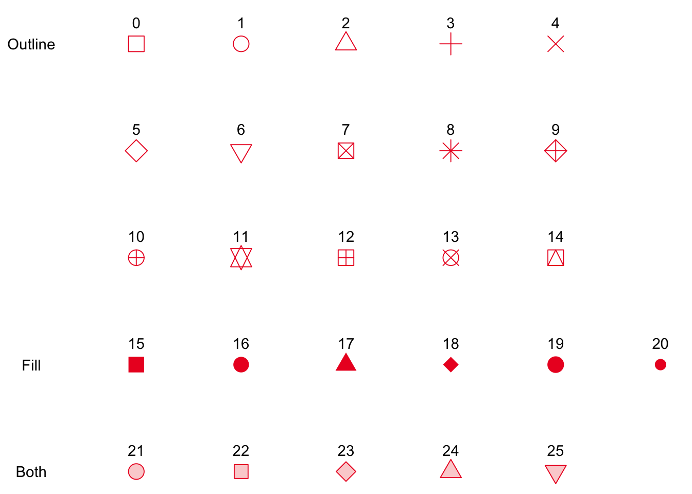

```{r setup, include=FALSE}
knitr::opts_chunk$set(echo = TRUE)
```


# Objectives

We, data scientists, work with data and endeavor to make sensible decisions based on data. We analyze data by first understanding the data and then extracting useful information to assist decision making. 

One without rich knowledge in medicine and years of experience in clinical practice cannot be a doctor, not to mention a good doctor. Same applies to a data scientist, we need to accumulate experience in dealing with data by hands-on experience. Deciding on what data to collect and what we are looking for from the data are is very important first step toward every successful study. This requires you to equip yourself with a toolset, i.e. R packages/functions, in manipulating, summarizing and visualizing data, which is the cornerstone of our journey towards a great data scientist. 


**Useful packages:**

We will focus on four specific packages `dplyr`, `ggplot`, `purrr` and `data.table`. `dplyr`, `ggplot`, and `purrr` are part of a broader library called `tidyverse` which consolidates commonly-used data science packages. See more here:
https://www.tidyverse.org/.

* `dplyr` can be used for data manipulation, providing a consistent set of verbs that solve the most common data manipulation challenges. [Cheatsheet](https://raw.githubusercontent.com/rstudio/cheatsheets/master/data-transformation.pdf)
* `ggplot` is used for creating Graphics or Plots.  [Cheatsheet](https://raw.githubusercontent.com/rstudio/cheatsheets/master/data-visualization-2.1.pdf)
* `purrr` is a functional programming toolkit that helps you replace for loops to improve readability. [Cheatsheet](https://raw.githubusercontent.com/rstudio/cheatsheets/master/purrr.pdf)
* `data.table` is an R package that provides an enhanced version of `data.frames`. Its speed makes it a preferable package to manipulate BIG data. [Cheatsheet](https://raw.githubusercontent.com/rstudio/cheatsheets/master/datatable.pdf)


In addition to `tidyverse` and `data.table`, packages `skimr`, `nycflights13`, `gapminder`, `ggthemes`, `ggpubr` and `plotly` will be used in the tutorial. We use the `p_load` function of `pacman`, to load all the packages at once. It will first check whether packages are installed. If not, it will install the yet to be installed automatically and then load all the packages.

```{r Install/Load packages, echo=FALSE, message=FALSE, warning=FALSE}
if(!require('pacman')) {
  install.packages('pacman')
}
pacman::p_load(tidyverse, skimr, nycflights13, gapminder, ggthemes, ggpubr, data.table, plotly)
```


# Using `dplyr`

Before we dig into details about `dplyr`, let us first find out information about `dplyr`. We may always want to Google first: r:dplyr. Alternatively, most R-packages provide vignettes which explain the package, usage, etc. We may use `vignette()` or 
`browseVigenttes("package name")` to get the vignette. 

```{r, vignette, eval = FALSE}
browseVignettes("dplyr") # web version
vignette("dplyr") # version inside Rstudio
```
There are several documents in the vignette for `dplyr`. Let us explore *Introduction to `dplyr`* where it includes `dplyr.rmd`, `dplyr.html` and `dplyr.R`. (The very first draft of the Advanced R Tutorial contains some materials from `dplyr.rmd`).

We next start to highlight `dplyr`.

Below is a table of popular `dplyr` commands. We will go through each one. 

|dplyr Command|SQL equivalent|Action|
|---|---|---|
|`filter()`|WHERE|Limit based on condition|
|`select()`|SELECT|Choose only certain variables|
|`distinct()`|DISTINCT|De-duplicate result-set|
|`arrange()`|ORDER BY|Order results|
|`rename()`|SELECT|Rename variables|
|`mutate()`|SELECT|Create new variable|
|`group_by()`|GROUP BY |Group rows|
|`summarise()`|SELECT|Create new variable in grouped setting|
|`join()`|JOIN|Join tables

You can also view the full cheat sheet here: [DPLYR Cheat Sheet](http://www.rstudio.com/wp-content/uploads/2015/02/data-wrangling-cheatsheet.pdf)

To illustrate these commands, we will use a dataset called `flights` in the `nycflights13` package that contains 336,776 flights departed from New York City in 2013. `dplyr` allows you to gather insight from a dataset without altering the original dataset. 
It is considered best practice not to alter the original dataset. For example, in this case, we will never overwrite the existing dataset 'flights'. We will first take a look at the the dataset and summary statistics.

```{r load data and summary, results='hide'}
library(nycflights13) # since we have load nycflights13 in the first r chunk, we do not need to library it again. 
names(flights) # find the variables
dim(flights) # size of the data
str(flights) # structure of the data
summary(flights) # may spot peculiar/unusual...
```
Notice that there are many missing values in the dataset. This raises alerts to us about the data. Since our focus in this lecture is about various R packages, we will not get into how to deal with missing values at the moment. **BUT IT IS A VERY IMPORTANT ISSUE** we always need to address in data analyses. 

We could use the package `skimr` to get a better organized summary.
```{r, summary of flights, eval = FALSE}
# summary(flights)
skim(flights) # it doesn't seem to report missing values
```


## Pipes

The `%>%` command is called a pipe. This means that the result of the code before `%>%` is sent, or "piped", to the one after `%>%`. Piping is a powerful tool for clearly expressing a sequence of multiple operations, as we will see shortly.

Here's an example of using piping to first square `1:5` and then sum them up.
`.` indicates the previous piping output. The following is equivalent to 
`sum((1:5)^2)`.
```{r piping}
1:5 %>% 
  .^2 %>% 
  sum
```


## Filter

The filter command will only display the subset of your dataset that match a certain condition. This command will only show flights on Jan 1st, 2013.  

This code is the same as doing `filter(flights, month == 1 & day == 1)` since the `%>%` command passes the `flights` dataframe to the filter command. `&` means the AND operation, `|` means the OR operation.

```{r}
flights %>%
  filter(month == 1 & day == 1)
```

It is important to remember that this command does not alter the original `flight` dataset. If we want to save this subset as its own object, we run the following. Remember the `<-` is the assignment operator in `R`. 
```{r}
filteredFlight <- flights %>%
  filter(month == 1 & (day == 1 | day == 2))
filteredFlight
# View(filteredFlight)
```

Multiple conditions can be included in a filter command. The command below shows any flights from Jan through June to PHL or SLC airports. 
```{r}
flights %>%
  filter(dest %in% c("PHL","SLC") & month <= 6)
```

## Select

Select will only return columns that are listed. In this case, the resulting dataset will consist of the Origin, Destination, and Carrier of flights that were destined for PHL or SLC in the first 6 months of the year. Remember, the pipe command sends the result of the current line to the next line. In this case, the filtered dataset is then piped into the select command. 

```{r}
flights %>%
  filter(dest %in% c("PHL","SLC") & month <= 6) %>%
  select(origin, dest, carrier)
```

On the contrary, we can use `-` to deselect columns. If we want to drop `year`, `month` and `day`, we just need to prefix `-` to each column name.
```{r}
flights %>%
  filter(dest %in% c("PHL","SLC") & month <= 6) %>%
  select(-year, -month, -day)
```

## Distinct

Distinct will remove any duplicate rows from the given dataset. Notice in the previous command, it returned a subset with 2116 rows, but with distinct, we can see that only 8 carriers flew to PHL or SLC in the first half of the year. 

```{r}
flights %>%
  filter(dest %in% c("PHL","SLC") & month <= 6) %>%
  select(origin, dest, carrier) %>% 
  distinct()
```

## Arrange

Arrange puts your data into alphabetical order. In this case the order is first by origin, then descending alphabetical order of the destination, then alphabetical order of carrier. 

```{r}
flights %>%
  filter(dest %in% c("PHL","SLC") & month <= 6) %>%
  select(origin, dest, carrier) %>% 
  distinct() %>%
  arrange(origin, desc(dest), carrier)
```

## Rename
The Rename function can be used to easily rename a column Header. Here, we rename carrier to airline. 
The syntax is as follows. `rename(<newname> = <oldname>)`

```{r}
flights %>%
  filter(dest %in% c("PHL","SLC") & month <= 6) %>%
  select(origin, dest, carrier) %>% 
  distinct() %>%
  arrange(origin, desc(dest), carrier) %>%
  rename(airline = carrier)
```

## Mutate
Mutate is used to create new columns based on current ones. This feature is very useful. Here, we create three new variables "gain", "speed", and "gain_per_hour". Notice how "gain_per_hour" uses the column "gain", which was created in the same mutate statement.  

```{r}
flights %>%
  mutate(gain          = dep_delay - arr_delay, 
         speed         = distance / air_time * 60, 
         gain_per_hour = gain / (air_time / 60)) %>% 
  select(dep_delay, arr_delay, gain, distance, distance, air_time, speed, gain_per_hour)
```

Use `transmute` if you only want to keep the new variables.
```{r}
flights %>%
  transmute(gain          = dep_delay - arr_delay, 
            speed         = distance / air_time * 60, 
            gain_per_hour = gain / (air_time / 60)) 
```


## Group By and Summarise

Group by and summarise often go together to get summary statistics for each group. 
Reorganize dataframe by rows according to the column that is grouped by; summarise then gives statistics of that group. Here, the origin column had three categories, `EWR`, `JFK`, & `LGA`. The `group_by(origin)` command organizes the dataframe by the three origins. Then `summarise()` is used to get metrics related to each origin.

From this table, we can see that EWR had the most flights with 120835, and LGA had the lowest avg delay at 10.34.

```{r}
flights %>%
  group_by(origin) %>%
  summarise(num_of_flights = n(), 
            avg_delay      = mean(dep_delay, na.rm = TRUE)) # na.rm removes any NA data
```

`group_by` can also take expressions. The following returns the number of flights that started late AND arrived late; started early AND arrived early (or on time).
```{r}
flights %>%
  filter(!is.na(dep_delay) & !is.na(arr_delay)) %>%
  group_by(dep_arr_late = dep_delay > 0 & arr_delay > 0) %>%
  summarise(num_of_flights = n())
```

Summarise has a number of other functions that can be used within it. For example,
the commonly-used `mean()`, `sum()`, `max()`, `min()`. Sometimes we might be interested in
value in specific position in each group, such that `first()` and `last()` retrieves
the first and last value respectively. `nth(, index)` retrieves the nth value.
You can combine `arrange()` and `nth()` to get the n-th largest value.
```{r}
flights %>%
  distinct(origin, dest, distance) %>%
  group_by(origin) %>%
  arrange(origin, -distance) %>%
  summarise(thrid_farthest = nth(distance, 3))
```

`n_distinct(dest)` returns the number of distinct destinations. From this table we can see that EWR has flights to the largest number of destinations (56). We can also see LGA flights have a lower average distance than those of EWR & JFK.  

```{r}
flights %>%
  group_by(origin) %>%
  summarise(destinations = n_distinct(dest), 
            avg_distance = mean(distance, na.rm = TRUE))
```

`group_by` also takes multiple variables. For example, say we want to know what the farthest flight to leave NYC is. To answer this, we can group by origin and destination, summarise the max distance for each pair, and then order by the maximum distance value we created. It is now easy to see that the max distance was from EWR or JFK to HNL. 
```{r}
flights %>%
  group_by(origin, dest) %>%
  summarise(max_distance = max(distance)) %>%
  arrange(desc(max_distance))
```


In addition to `summarise()`, `group_by()` can be useful for other proposes.
For example, get the summary statistics of `arr_delay` by carrier.
```{r, eval = FALSE}
flights %>%
  # filter(carrier %in% c("AA", "UA")) %>%
  group_by(carrier) %>%
  skim(arr_delay)
```

Another example is to find out some of the worst flights of AA and UA.
```{r}
flights %>%
  filter(carrier %in% c("AA", "UA")) %>%
  group_by(carrier, month) %>%
  filter(rank(-arr_delay) < 3) %>%
  arrange(carrier, month, -arr_delay)
```

## Join

When you have two tables, you might want to merge them together. 
For example, `airlines` data is a table of carries' symbol and their corresponding full name.

```{r}
airlines
```

Now we want to get the total number of flights of each carriers with their full name attached.
First, we will use `group_by()` and `summarise()` to get the total number of flights for each carriers.
Then, we use a `join()` function to join the result table with `airlines`.
The `by` argument tells `join()` function which variable is the key to join. 
In our example, we want to join two tables by the `carrier` variables, 
so `carrier` is our key variable to join.

```{r}
flights %>%
  group_by(carrier) %>%
  summarise(num_of_flights = n()) %>%
  left_join(airlines, by = "carrier") %>%
  arrange(-num_of_flights)
```

There are different types of joins: `left_join()`, `right_join()`, `inner_join()`,
and `full_join()`. 

* `left_join()`: keep all observations in `x`, which is `flights` in our example. 
If there's no corresponding key value in `y` table, the joined table will have `NA`.
* `right_join()`: keep all observations in `y`, which is `airlines` in our example 
* `inner_join()`: keep match pairs only and drop rows that do NOT have keys in both tables. 
* `full_join()`: keeps all observations in `x` and `y`.

Here's a Venn diagram to depict them.


To compare different joins, let's create a look up table that includes
United Airlines, American Airlines, and Lufthansa. We compare the join results using
`inner_join()`, `left_join()` and `right_join()`.

```{r}
my_airlines <- data.frame(abbr = c("AA", "LH", "UA"),
                          name = c("American Airline", "Lufthansa", "United Airline"))
```

Since only AA and UA are in both tables,
the inner-joined table will only keep AA and UA and drop LH.
```{r}
# inner_join
flights %>%
  group_by(carrier) %>%
  summarise(num_of_flights = n()) %>%
  inner_join(my_airlines, by = c("carrier" = "abbr")) %>%
  arrange(-num_of_flights)
```
Left-joined table will keep all observations in `x` (`flights`).
So for carries that are not in `my_airlines`, they have `NA` name.
```{r}
# left_join
flights %>%
  group_by(carrier) %>%
  summarise(num_of_flights = n()) %>%
  left_join(my_airlines, by = c("carrier" = "abbr")) %>%
  arrange(-num_of_flights)
```
Right-joined table will keep all observations in `y` (`my_airlines`),
so LH has `NA` number of flights.

```{r}
flights %>%
  group_by(carrier) %>%
  summarise(num_of_flights = n()) %>%
  right_join(my_airlines, by = c("carrier" = "abbr")) %>%
  arrange(-num_of_flights)
```

More on joining tables, see [here](https://r4ds.had.co.nz/relational-data.html).

## Question

Get the cumulative amounts of flights of each airline by month. Hint: use the cumulative sum function `cumsum()`.


# Using `ggplot`

`ggplot` is THE tool for exploratory data analysis.
Exploratory data analysis is a way to develop an understanding of your data and
we cannot stress more about understanding your data as data scientists. 
`ggplot` is one of the best tools for plotting graphs among other software/libraries
(Matlab, Python's matplotlib). Our goal here is to let graphs tell the number using `ggplot`. 

`gg` means the grammar of graphics. The basic idea of `ggplot` is to independently specify building blocks and combine them to create just about any kind of graphical display you want. Building blocks of a graph include:

+ data
+ aesthetic mapping (x, y axes; group; color)
+ geometric object (line, bar)
+ faceting

## Aesthetic Mappings

In `ggplot` land aesthetic means "something you can see". Examples include:

+ position (i.e., on the x and y axes)
+ color ("outside" color)
+ fill ("inside" color)
+ shape (of points)
+ size

[Gapminder](https://www.gapminder.org/) is an non-profit organization. The goal is to give correct view about the world.  The package `gapminder` contains a data set also named `gapminder`. But this dataset is about world life expectancy statistics. Let's do a quick summary.

```{r, eval = FALSE}
summary(gapminder)
# skim(gapminder)
```


## Plots by Data Types


|**Data** | **Plots** | **Geom (ggplot command)**|
|----------------------------------|----------------------|----------------------------|
| One Continuous | Histogram | geom_histogram |
| One Continuous + One Categorical | Boxplot | geom_boxplot |
| Two Continuous | Scatter Plot | geom_point |
| Three Continuous | Scatter Plot + Size | geom_point w/ size aesthetic |
| Two Continuous + One Categorical | Scatter Plot + Color | geom_point w/ color aesthetic |
| Categorical with reasonable number of levels  | Faceting!! |  facet_wrap() |

**Note: Time is always the x-axis.**

There are many more geom types, but we will focus on the ones listed in the table above.

[Here](https://www.rstudio.com/wp-content/uploads/2015/03/ggplot2-cheatsheet.pdf) is an extremely useful cheatsheet that shows all of ggplots functions and how to use them.

## One Continuous /  Geom_Histogram

The following shows the histogram of life expectancy in 2007. Life expectancy is a continuous variable, so we use `geom_histogram()`.

Note how the `%>%` or "piping" also works with ggplot. If you are not piping in a dataframe, the first input to ggplot should be your dataframe. For example, the command would become `ggplot(gapminder, aes(x = lifeExP)) + geom_histogram(binwidth = 2)`
```{r lifeExp hist}
hist(gapminder$lifeExp)
gapminder %>%
  ggplot(aes(x = lifeExp)) + 
  geom_histogram(binwidth = 2)
```
What has caught your eyes right away?

Life expectancy in other years:

```{r leftExp 2007}
summary(gapminder)
gapminder %>% filter(year == 2005) %>%  # 2005 > no histogram, why not? 
  ggplot(aes(x = lifeExp)) + 
  geom_histogram(binwidth = 2)
# see what year we have
unique(gapminder$year)
gapminder %>% 
  filter(year == 1952) %>%  # change to other years
  ggplot(aes(x = lifeExp)) + 
  geom_histogram(binwidth = 2)
gapminder %>% 
  filter(year == 2007) %>%  # change to other years
  ggplot(aes(x = lifeExp)) + 
  geom_histogram(binwidth = 2)
# put two together using facet_wrap()
gapminder %>% 
  filter(year %in% c(1952, 2007)) %>%
  ggplot(aes(x = lifeExp)) + 
  geom_histogram(binwidth = 2) +
  facet_wrap(~year)
```

## One Continuous + One Categorical / Geom_boxplot

Now, we want to show `lifeExp` broken down by continent. `Continent` is a categorical variable, also called factors in R. For this, we use the `geom_boxplot()` command. 

```{r}
gapminder %>%
  filter(year == 2007) %>%
  ggplot(aes(x = continent, y = lifeExp)) + 
  geom_boxplot()
```


## Two Continuous / Geom_Point

Using `geom_point()` we create a scatter plot of our two continuous variables, `gdpPercap` and `LifeExp`.

```{r}
plot(gapminder$gdpPercap, gapminder$lifeExp, pch=16)
gapminder %>%
  filter(year == 2007) %>%
  ggplot(aes(x = gdpPercap, y = lifeExp)) + 
  geom_point()
```

Some relationships will look better on different scales, and ggplot allows you to change scales very quickly. Here we log the x-axis, with `scale_x_log10()`, which makes the relationship between these two variables much clearer. Use `size` and `shape` argument in `geom_point()` to adjust the size and the shape.
The options of shape is indexed as follows.


*Credit to https://blog.albertkuo.me/post/point-shape-options-in-ggplot/*

```{r, message=FALSE}
gapminder %>%
  filter(year == 2007) %>%
  ggplot(aes(x = gdpPercap, y = lifeExp)) + 
  geom_point(size = 1, shape = 5) +
  scale_x_log10()
```

## Three Continuous / Geom_point With Size Aesthetic

If we want to show three continuous variables at the same time, we can use the size aesthetic in ggplot. This will alter the size of the point by the value in the `pop` column of the gapminder data frame.

```{r, message=FALSE}
gapminder %>%
  filter(year == 2007) %>%
  ggplot(aes(x = gdpPercap, y = lifeExp, size = pop)) + 
  geom_point() +
  scale_x_log10()
```


## Two Continuous + One Categorical / Geom_point With Color Aesthetic

To show more insight into this graph, we can show each point by which continent it is from. Adding the color Aesthetic allows us to show a categorical variable, `continent`, as each point is colored by what continent it is from.

```{r, message=FALSE}
gapminder %>%
  filter(year == 2007) %>%
  ggplot(aes(x = gdpPercap, y = lifeExp)) + 
  geom_point(aes(size = pop, color = continent)) +
  scale_x_log10()
```


## Linear model line quickly / Geom_smooth

`ggplot` can also quickly add a linear model to a graph. There are also other models geom_smooth can do ("lm", "glm", "gam", "loess", "rlm"). If you leaving it blank it will automatically choose one for you, but that is not recommended. 

```{r,message=FALSE}
gapminder %>%
  filter(year == 2007) %>%
  ggplot(aes(x = gdpPercap, y = lifeExp)) + 
  geom_point() + 
  geom_smooth(se = TRUE)
```
To add the linear model line, we add `geom_smooth(method = 'lm', se = TRUE)` to the command. `se = TRUE` tells it to plot the standard error ranges on the graph.  

```{r,message=FALSE}
gapminder %>%
  filter(year == 2007) %>%
  ggplot(aes(x = log(gdpPercap), y = lifeExp)) + 
  geom_point(aes(col = continent)) + 
  geom_smooth(method = 'lm', formula = 'y~x', se = TRUE)
```
Note that `aes()` in `ggplot()` is a global setting, it will affect all geometric objects. It is the best practice to put aesthetic setting for each geometric objects. See the difference in the next plot.

```{r,message=FALSE}
gapminder %>%
  filter(year == 2007) %>%
  ggplot(aes(x = log(gdpPercap), y = lifeExp, col = continent)) + 
  geom_point() + 
  geom_smooth(method = 'lm', formula = 'y~x', se = TRUE)
```

## Trend

So far we have been plotting a cross-sectional plot. 
We can use `geom_line()` with x-axis as `year` and y-axis as `life expectancy`.
We plot the trend of life expectancy of US.
```{r}
gapminder %>%
  filter(country == "United States") %>%
  ggplot(aes(x = year, y = lifeExp)) +
  geom_line()
```

Now we want to plot the life expectancy trend of each country.
We call it the **spaghetti plot**.
We need to tell `geom_line()` to `group` the line by `country`. 
We use different colors to separate continents.

```{r}
gapminder %>%
  ggplot(aes(x = year, y = lifeExp)) +
  geom_line(aes(group = country, col = continent))
```

It is a bit hard to see the pattern. 
We can add the trend of mean of each continent in our plot. 
In addition to the trend, we need to call another `geom_line()`
to plot the mean. To make the mean trend stand out, 
we set `alpha` for the transparency of the spaghetti.

```{r}
gapminder %>%
  ggplot(aes(x = year, y = lifeExp)) +
  geom_line(aes(group = country, col = continent), alpha = .2) +
  geom_line(data = gapminder %>% 
              group_by(continent, year) %>% 
              summarise(mean = mean(lifeExp)),
            aes(x = year, y = mean, group = continent, col = continent), 
            size = 1)
```

Another trend plot is that we want to see how each group changes.
We can use barplot with `fill` by each group. 
There are three position options for `geom_bar()`:

* **stack**: stacking number of each group together
* **dodge**: spread out each group
* **fill**: get the proportion of each group

```{r}
gapminder %>%
  ggplot(aes(x = year, y = pop, fill = continent)) + 
  geom_bar(position = "stack", stat = "identity") 
```
```{r}
gapminder %>%
  ggplot(aes(x = year, y = pop, fill = continent)) + 
  geom_bar(position = "fill", stat = "identity") 
```


## Faceting

Instead of changing the color of points on the graph by continent, you can also create a different graph for each continent by 'faceting'. Depending on the number of factors and your dataset, faceting may look better than just changing colors. To do this we add the `facet_wrap(~ continent)` command. 

```{r,message=FALSE}
gapminder %>%
  filter(year == 2007) %>%
  ggplot(aes(x = gdpPercap, y = lifeExp)) +
  geom_point() +
  scale_x_log10() +
  facet_wrap(~continent)
```

You can facet with any geom type. For example, our spaghetti plot. 
```{r}
gapminder %>%
  ggplot(aes(x = year, y = lifeExp)) +
  geom_line(aes(group = country, col = continent), alpha = .2) +
  geom_line(data = gapminder %>% 
              group_by(continent, year) %>% 
              summarise(mean = mean(lifeExp)),
            aes(x = year, y = mean, group = continent, col = continent), 
            size = 1) +
  facet_wrap(~ continent)
```


Another example, linear model of each continent. We can use `scales = "free"` in `facet_wrap()`
to free the scales of x, y axes. It is generally NOT recommend to do so since 
it can be misleading.
```{r,message=FALSE}
gapminder %>%
  filter(year == 2007) %>%
  ggplot(aes(x = log(gdpPercap), y = lifeExp)) + 
  geom_point() + 
  geom_smooth(method = 'lm', formula = 'y~x', se = TRUE)+
  facet_wrap(~ continent)
```

## Multiple plots: `ggpubr::ggarange()`

To put multiple plots together, use `ggarrange()` from `ggpubr` package. 

```{r}
p1 <- gapminder %>%
  ggplot(aes(x = year, y = lifeExp)) +
  geom_line(aes(group = country, col = continent), alpha = .2) +
  geom_line(data = gapminder %>% 
              group_by(continent, year) %>% 
              summarise(mean = mean(lifeExp)),
            aes(x = year, y = mean, group = continent, col = continent), 
            size = 1)
p2 <- gapminder %>%
  ggplot(aes(x = year, y = pop, fill = continent)) + 
  geom_bar(position = "stack", stat = "identity") 
# put p1 and p2 together
p <- ggpubr::ggarrange(p1, p2, common.legend = T, legend = "bottom", ncol = 2)
annotate_figure(p,
               top = text_grob("Life expectancy and Population", 
                               color = "black", face = "bold", size = 14))
```

## Saving plots `ggsave()`

Use `ggsave()` to save plots to png, jpeg or pdf. It plots the previous plot until we specify which plot to save.
```{r}
ggsave(filename = "fig/life_exp_population.pdf", width = 8, height = 5)
```

## `plotly` package

Plotly is an interactive web-based library. It is well-integrated with `ggplot2` via `ggplotly()`.
You can feed in any ggplots to `ggplotly()`, it will output 
an interactive plot. Note that since it is web-based, it only 
works when you knit to html.

```{r}
p <- gapminder %>%
  ggplot(aes(x = year, y = lifeExp)) +
  geom_line(aes(group = country, col = continent), alpha = .2) +
  geom_line(data = gapminder %>% 
              group_by(continent, year) %>% 
              summarise(mean = mean(lifeExp)),
            aes(x = year, y = mean, group = continent, col = continent), 
            size = 1)
ggplotly(p)
```

### Animation

One thing worth mentioning is animation with plotly. Use `frame` argument.

```{r}
p <- ggplot(gapminder, aes(gdpPercap, lifeExp, color = continent)) +
  geom_point(aes(size = pop, frame = year, ids = country)) +
  scale_x_log10()
ggplotly(p)
```

## Theming

`ggplot` makes it very easy to create very nice graphs, using whats called a theme. There are many default themes or you can make your own. Almost everything is customizable on ggplot, including sizes, colors, font types, etc. Below is a example of building a theme.

To use a theme, it is simply added on the end of your ggplot string of commands. You can also add titles with `ggtitle()`, change labels with `xlab()` and `ylab()` command. 

```{r,echo=FALSE, warning=FALSE}
theme_new <- theme_bw() +
  theme(plot.background = element_rect(size = 1, color = "blue", fill = "black"),
        text=element_text(size = 12, family = "Courier", color = "yellow"),
        axis.text.y = element_text(colour = "purple"),
        axis.text.x = element_text(colour = "red", angle = -30, hjust = 0, vjust = 1),
        panel.background = element_rect(fill = "pink"),
        strip.background = element_rect(fill = "orange"),
        legend.background = element_rect(fill = "black"))
gapminder %>%
  filter(year == 2007) %>%
  ggplot(aes(x = log(gdpPercap), y = lifeExp)) + 
  geom_point(aes(col = continent)) +
  geom_smooth(method = 'lm', formula = 'y~x', se = TRUE) + 
  ggtitle("Life Expectancy by GDP per Capita") + 
  xlab("log(GDP per Capita)") + 
  ylab("Life Expectancy") + theme_new
```

### Scale

We might want to change the label or color of the legend. Scale family will come in handy.

We can use `scale_color_brewer()` or `scale_fill_brewer()` with `palette` argument 
depends on you are using `col` or `fill` aesthetics.
Here are the available palettes:

* Diverging: BrBG, PiYG, PRGn, PuOr, RdBu, RdGy, RdYlBu, RdYlGn, Spectral
* Qualitative: Accent, Dark2, Paired, Pastel1, Pastel2, Set1, Set2, Set3
* Sequential: Blues, BuGn, BuPu, GnBu, Greens, Greys, Oranges, OrRd, PuBu, PuBuGn, PuRd, Purples, RdPu, Reds, YlGn, YlGnBu, YlOrBr, YlOrRd

```{r}
gapminder %>%
  filter(year == 2007) %>%
  ggplot(aes(x = log(gdpPercap), y = lifeExp)) + 
  geom_point(aes(col = continent)) +
  scale_color_brewer(palette = "Spectral", 
                     labels = c("AFRICA", "AMERICA", "ASIA", "EUROPE", "OCEANIA")) + 
  labs(colour = "CONTINENT")
```

```{r}
gapminder %>%
  ggplot(aes(x = year, y = pop, fill = continent)) + 
  geom_bar(position = "stack", stat = "identity") +
  scale_fill_brewer(palette = "Spectral", direction = -1)
```


We can also [scale by manual](https://ggplot2.tidyverse.org/reference/scale_manual.html)
or [scale by gradient](https://ggplot2.tidyverse.org/reference/scale_gradient.html) for continuous variable.


### `ggthemes`
You can also use pre-existing themes. `ggthemes` recreates popular themes from websites and magazines. See its gallery [here](https://yutannihilation.github.io/allYourFigureAreBelongToUs/ggthemes/). Here is one based on The Economist magazine. 

```{r, echo = FALSE, message=FALSE, quietly = TRUE}
gapminder %>%
  ggplot(aes(x = gdpPercap, y = lifeExp)) + 
  geom_point(aes(alpha = year)) +
  geom_smooth(method = 'lm', se = TRUE) + 
  scale_x_log10() + theme_economist() + 
  labs(title ="Life Expectancy by GDP per Capita", 
       x = "GDP per Capita", 
       y = "Life Expectancy")
```


# Using `apply` and `purrr::map` family

In basic R tutorial, we mentioned that R is a functional programming language.
Functional programming languages write programs by applying and composing functions.
It allows us to pass a function into a function.

For example, if we want to get the mean and sd for each column of a data frame,
we can do it one by one, or by a for loop, or using the advantage of R being a functional programming language.
(Remember that each column of one data frame is a list!)
```{r}
gapminder_sub <- gapminder %>% select(lifeExp, pop)
# get mean
gapminder_sub_mean <- rep(NA, ncol(gapminder_sub))
for(i in seq_along(gapminder_sub)) {
  gapminder_sub_mean[i] <- mean(gapminder_sub[[i]])
}
# get sd
gapminder_sub_sd <- rep(NA, ncol(gapminder_sub))
for(i in seq_along(gapminder_sub)) {
  gapminder_sub_sd[i] <- sd(gapminder_sub[[i]])
}
```

Then we might come up with more statistics to calculate for each column. 
Copying and pasting the for loop code again makes your code redundant and hard to read. 
And this practice is always prone to error and very inflexible.
More importantly, as your code get complicated, it gets very hard to debug.
What if we want to do the same thing to other data set?

R allows us to pass a function to function. Instead of writing three functions
that have a similar structure with only different being `mean()` or `sd()`, 
we can pass a function as argument into a function.
```{r}
col_summary <- function(df, fun) {
  output <- rep(NA, ncol(df))
  for(i in seq_along(df)) {
    output[i] <- fun(df[[i]])
  }
  output
}
col_summary(gapminder_sub, mean)
```

We can even pass our self-defined function into `col_summary()`.
```{r}
log_mean <- function(x) {
  mean(log(x))
}
col_summary(gapminder_sub, log_mean)
```

Apply a function to each element of a list/vector is so common that `apply` class
function and `purrr` package are designed specifically for this purpose.
They are implemented in C, which makes them a little faster.

## `lapply()` and `map()`
`lapply()` and `map()` takes a vector or a list and apply a function to
each element and output a list. Function arguments (e.g. `na.rm=T`) follows function name.
```{r}
lapply(gapminder_sub, mean, na.rm = T)
map(gapminder_sub, mean, na.rm = T)
```
## `sapply()/vapply()` and `map_*()`

`sapply()` and `vapply()` are wrappers around `lapply()` that simplifies the output 
from a list to vector/matrix. They basically do the same thing but
`vapply()` is considered to be a safer choice because you have to specify the type of the output.
`map_*()` is a simple alternative for `vapply()` by specifying the return type.

`map_*()` | return 
---------------|---------------
 `map_lgl()` | logical vector
`map_int()` | integer vector
`map_dbl()` | double vector
`map_chr()` | character vector

For example, we want to check the class of each column.
```{r}
sapply(gapminder, class)
vapply(gapminder, class, character(1))
map_chr(gapminder, class)
```

`vapply()` and `sapply()` can output matrix while `map_*()` can only output vector.
```{r}
vapply(gapminder_sub, summary, numeric(6))
```


## Anonymous function
We can write function within `apply` and `map` class function as well!
```{r}
vapply(gapminder_sub, function(x) mean(log(x)), numeric(1))
map_dbl(gapminder_sub, function(x) mean(log(x)))
```


# Using `data.table`
As an enhanced version of `data.frame`, one can do a lot more than subsetting rows and selecting columns within the frame of `data.table`, i.e., within `[ ... ]`. The general form of `data.table` syntax is as shown below:

```{r echo=F}
cat("DT[i, j, by]
#   R:        i            j        by
# SQL:  where   select | update  group by")
```

**The way to read it (out loud) is [as suggested]((https://cran.r-project.org/web/packages/data.table/vignettes/datatable-intro.html)):**

Take `DT`, subset rows using `i`, then calculate `j`, grouped by `by`.

Let's redo the work by `dplyr` above in the `data.table` way. This tutorial will only cover the basics of `data.table`. There are more advanced `data.table` operations that come in handy. See the `data.table` cheat sheet [here](https://s3.amazonaws.com/assets.datacamp.com/img/blog/data+table+cheat+sheet.pdf). Comparisons between `dplyr`, `data.table` and `pandas` (a popular Python package) in terms of speed can be found [here](https://github.com/Rdatatable/data.table/wiki/Benchmarks-:-Grouping).

## `fread()` and `fwrite()`

`fread()` and `fwrite()` are similar to `read.csv()` and `write.csv()` for reading and writing data respectively but they are much faster, especially for BIG dataset.

## Create `data.table`

`setDT` transforms `data.frame` into `data.table`. Notice that since `data.table` is an enhanced version of `data.frame`, operations on `data.frame` are still available to `data.table`. We first make a copy of `flights` and transform it into `data.table`.
```{r}
flights2 <- copy(flights)
setDT(flights2)
class(flights2)
```

## Subset rows in `i`

**To show flights on Jan 1st, 2013:**

`dplyr`: 
```{r, eval=FALSE}
flights %>% filter(month == 1 & day == 1)
```

`data.table`:
```{r, eval=FALSE}
flights2[month == 1 & day == 1]
```

**To get any flights from Jan through June to PHL or SLC airports:** 

`dplyr`:
```{r, eval=FALSE}
flights %>% filter(dest %in% c("PHL","SLC") & month <= 6)
```

`data.table`:
```{r, eval=FALSE}
flights2[dest %in% c("PHL","SLC") & month <= 6]
```

**To get the first N row:**
`dplyr`:
```{r, eval=FALSE}
flights[1:2,]
```

`data.table`:
```{r, eval=FALSE}
flights2[1:2]
```


## Sort rows in `i`
**To sort column `origin` in ascending order, and then by `dest` in descending order: **
`dplyr`:
```{r, eval=FALSE}
flights %>% 
  select(origin, dest, carrier) %>% 
  distinct() %>%
  arrange(origin, desc(dest), carrier)
```

`data.table`:
```{r, eval=FALSE}
unique(flights2[order(origin, -dest), .(origin, dest, carrier)])
```


## Select column(s) in `j`

**To select Origin, Destination, and Carrier of flights:**
`dplyr`:
```{r, eval=FALSE}
flights %>% select(origin, dest, carrier)
```

`data.table`:
```{r, eval=FALSE}
flights2[, list(origin, dest, carrier)]
```
or

```{r, eval=FALSE}
flights2[, .(origin, dest, carrier)]
```

or you can also store the columns' names into a variable and select them using `.SDcols` and `.SD` (Subset of Data.table). data.table also has a special syntax `..` for selecting columns by a vector.
```{r, eval=FALSE}
select_columns <- c("origin", "dest", "carrier")
flights2[, .SD, .SDcols = select_columns]
# flights2[, ..select_columns]
```

When selecting only one column, `data.table` allows us to return the column as a vector as what the base `$` does.

If 

**To select origin and return it as a vector: **
`dplyr`:
```{r, eval=FALSE}
flights$origin
flights %>% pull(origin)
```

`data.table`:
```{r, eval=FALSE}
flights2[, origin]
```

**To rename `dest` to `destination` and `carrier` to `airline`: **

`dplyr`:
```{r, eval=FALSE}
flights %>%
  select(origin, dest, carrier) %>% 
  rename(dest = destination, airline = carrier)
```

`data.table`:
```{r, eval=FALSE}
renames(flights2, 
        old = c("dest", "airline"), 
        new = c("destination", "carrier"))
```

Notice that in `dplyr`, the syntax is `rename(old_name = new_name)` which be read as "rename old_name to new_name".

## Compute in `j`
Other than selecting columns, `j` can also handle expressions. For example, 

**To compute how many trips had total `delay < 0`**:
`base`:
```{r}
sum((flights$arr_delay + flights$dep_delay) < 0, na.rm = T)
```

`data.table`:
```{r}
flights2[, sum((arr_delay + dep_delay) < 0, na.rm = T)]
```

## Special symbol `.N`
There are some special symbol in `data.table`, e.g. `.N`, `.SD`, `.SDcols`. `.N` holds the number of observations in the current group. Think of it as a counterpart of `n()` of `dplyr`.

**To count the total number of flights:**
`dplyr`:
```{r}
flights %>%
  summarise(num_of_flights = n())
```

`data.table`:
```{r}
flights2[, .(num_of_flights = .N)]
```

## Special symbol `:=`
To create new columns as what `mutate` of `dplyr` does:

`dplyr`:
```{r, eval=FALSE}
flights %>%
  mutate(gain = dep_delay - arr_delay)
```

`data.table`:
```{r, eval=FALSE}
flights2[, gain := dep_delay - arr_delay]
```

**To remove `gain`:**
Use `:= NULL` to remove columns.
```{r}
flights2[, gain := NULL]
```

## Grouping using `by`
Similar to `group_by` of `dplyr`, `data.table` applies the operations in `j` to groups specified in `by`.

**To count the total number of flights from each origin and average delay time of each: **
`dplyr`:
```{r, eval=FALSE}
flights %>%
  group_by(origin) %>%
  summarise(num_of_flights = n(),
            avg_delay      = mean(dep_delay, na.rm = TRUE))
```

`data.table`:
```{r, eval=FALSE}
flights2[, .(num_of_flights = .N, 
             avg_delay      = mean(dep_delay, na.rm = TRUE)), 
         by = origin]
```


`by` also takes expressions like `group_by` does. 

**To count the number of flights that started late but arrived early (or on time), started and arrived late etc.:**
`dplyr`:
```{r, eval=FALSE}
flights %>%
  filter(!is.na(dep_delay) & !is.na(arr_delay)) %>%
  group_by(dep_delay > 0, arr_delay > 0) %>%
  summarise(num_of_flights = n())
```

`data.table`:
```{r, eval=FALSE}
flights2[!is.na(dep_delay) & !is.na(arr_delay), 
         .N, by = .(dep_delay>0, arr_delay>0)]
```

## `apply` function

`data.table` supports `lapply()` function to operation on columns.
The following code get the total number of `NA` of each column.
Remember `.SDcols` and `.SD` (Subset of Data.table) are for selecting columns.
```{r}
vapply(flights, function(x) sum(is.na(x)), numeric(1))
flights2[, lapply(.SD, function(x) sum(is.na(x))), .SDcols = names(flights)]
```

## Joining using `merge()`

To join two tables using data.table, use `merge()` function. 
The key variable(s) are passed via argument `by` if the key variable has same name,
or using `by.x` to indicate the key variable for `x` table and `by.y` for `y` table.
It uses argument
`all.x`, `all.y`, `all` to decide which join to operate.

* `left_join()`: `all.x=TRUE`
* `right_join()`: `all.y=TRUE`
* `inner_join()`: default
* `full_join()`: `all=TRUE`

`dplyr`:
```{r}
flights %>%
  group_by(carrier) %>%
  summarise(num_of_flights = n()) %>%
  left_join(airlines, by = "carrier") %>%
  arrange(-num_of_flights)
```

`data.table`:
```{r}
num_of_flights_by_carrier <- merge(flights2[, .(num_of_flights = .N), by = "carrier"],
                                   airlines,
                                   by = "carrier",
                                   all.x = T)
num_of_flights_by_carrier[order(-num_of_flights)]
```


## Chaining
`data.table` can tack expressions one after another, forming a chain of operations similar to piping `%>%`, i.e., DT[ ... ][ ... ][ ... ]. 

```{r, eval=FALSE}
flights2[, .(max_distance = max(distance)), by = .(origin, dest)
][order(-max_distance)]
```


# `dplyr` or `data.table`?
Choosing `dplyr` or `data.table` is a personal preference. [Here](https://stackoverflow.com/questions/21435339/data-table-vs-dplyr-can-one-do-something-well-the-other-cant-or-does-poorly) is Stack Overflow post concerning this question. Both authors of `dplyr` (Hadley) and `data.table` (Arun) compare their packages in terms of speed, memory usage and syntax. In short, `dplyr` is more readable (though readability is a subjective question); while `data.table` performs faster than `dplyr` as the data size grows, and uses less memory in several functions by its nature. A benchmark comparison between `dplyr`, `data.table` and `pandas` of Python is also available [here](https://github.com/Rdatatable/data.table/wiki/Benchmarks-:-Grouping) and a more comprehensive comparison [here](https://h2oai.github.io/db-benchmark/).

If you really want the pros of both, [`dtplyr`](https://dtplyr.tidyverse.org/) would be a solution. 
`dtplyr` allows you to write dplyr code and translate to data.table. 


# Running RStudio on Server/Cloud Services

Lastly, we introduce a way to run Rstudio in the cloud based on [Rstudio Server](https://support.rstudio.com/hc/en-us/articles/234653607-Getting-Started-with-RStudio-Server). This can come in handy when doing more complex analysis with larger datasets, as it will greatly speed up processing times. 

There are many existing guides to help you set up an RStudio instance on the cloud with Google or Amazon Web Services.

Here are a few good guides for using Google Cloud Services:

+ This [guide](http://markedmondson.me/run-r-rstudio-and-opencpu-on-google-compute-engine-free-vm-image) even comes with a free VM image for you to use
+ [Official Guide](https://cloudyr.github.io/googleComputeEngineR/), but does not have to much detail
+ [More detailed version of Official guide](http://code.markedmondson.me/launch-rstudio-server-google-cloud-in-two-lines-r/)

and Amazon Web Services: 

+ [Official Guide](https://aws.amazon.com/blogs/big-data/running-r-on-aws/)
+ [Another good guide](http://strimas.com/r/rstudio-cloud-1/)
