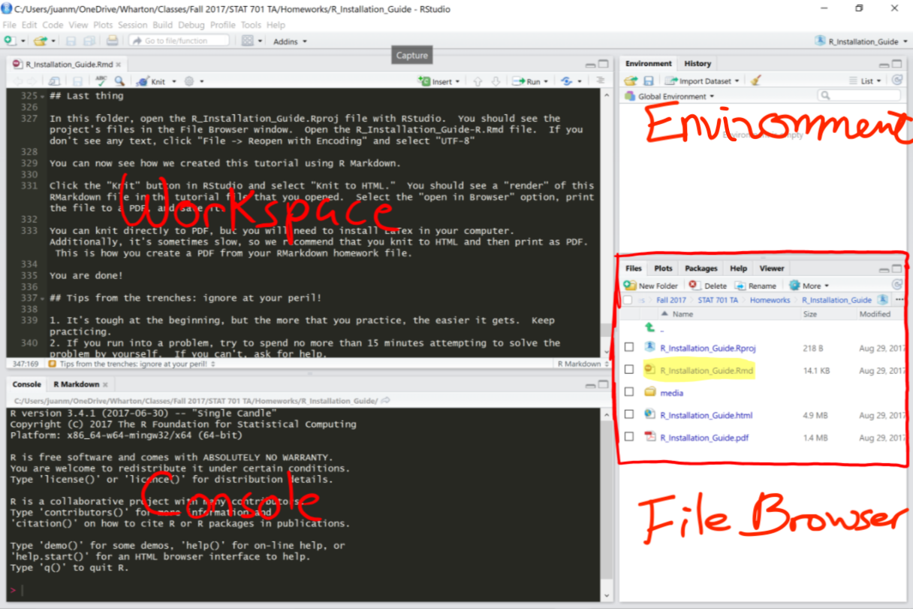

```{r setup, include=FALSE}
library(knitr)
knitr::opts_chunk$set(fig.height=5, fig.width=11, warning = F)
```

```{r, message=FALSE, warning=FALSE, echo=F}
# Initial code block to install curl if not already
if(!require('curl')) {
  install.packages('curl')
}

# Initial code block to check if data is in working directory.
if(!file.exists("data/Survey_results_final.csv") ||
   !file.exists("data/tips.txt") ||
   !file.exists("fig/rstudio_ss.png")) {
  err_str <- paste("You're missing data/figure files. Download them and put them into the corresponding subfolders with this Rmd file:", getwd(), ". See below for the folder structure. ")
  stop(err_str)
}
```

# Objectives
Install and introduce R, R Studio, and R Markdown (steps 0, 1 & 2). The additional steps are intended to help familiarize students with frequently used R functions for data analysis; however, some of it is provided as a reference and goes beyond the scope of this course.

An accompany zoom video walking you through this fie is available under Files/Video/Basic R tutorial.mp4. 

# Welcome!

This tutorial is designed to get you up and running with R as quickly as possible. If you have any questions, post them on [Piazza](https://www.piazza.com/wharton.upenn/summer2021/2021datascience). A teaching team member will answer questions there. 

In order to run this RMarkdown file, you will need to have the following .csv files in the *data/* folder
and the .png file in the *fig/* folder. Both *data/* and *fig/* folders should be in the same directory as the .Rmd file:

basic_R_tutorial/

* Get_staRted.Rmd
* data/
  * Survey_results_final.csv
  * tips.txt
* fig/
  * rstudio_ss.png

It is always a good idea to keep your project folder organized as follows.

project_folder/

* REAMD.MD: a README file for documentation
* project.RMD: main RMarkdown file
* data/: a folder to keep your data
* fig/: a folder to keep your plots
* output/: a folder to keep your output
* src/: a folder to keep your related codes


# Quick links

Useful links for your future reference.

* [R](https://cloud.r-project.org/)
* [RStudio](https://rstudio.com/products/rstudio/)
* [R Markdown cheatsheet](https://www.rstudio.com/wp-content/uploads/2015/02/rmarkdown-cheatsheet.pdf)
* [R Markdown options](https://yihui.name/knitr/options/)
* [ggplot2 cheatsheet](https://github.com/rstudio/cheatsheets/blob/master/data-visualization-2.1.pdf)
* [dplyr cheatsheet](http://www.rstudio.com/wp-content/uploads/2015/02/data-wrangling-cheatsheet.pdf)
* [data.table cheatsheet](https://s3.amazonaws.com/assets.datacamp.com/img/blog/data+table+cheat+sheet.pdf)
* [More cheatsheets](https://www.rstudio.com/resources/cheatsheets/)
* [ISLR](https://statlearning.com/)
* [R for Data Science](https://r4ds.had.co.nz)
* [Advanced R](http://adv-r.had.co.nz)

# Step 0: Install all the things!

## Base R
First, we need to install 'base R.' Different download mediums are available on [CRAN](https://cloud.r-project.org/); pick the correct one for your computer. I strongly advise updating to the most up to date version of R. If you are familiar with command line package managers, e.g. `brew`, feel free to use those toolchains.

Base R comes with a passable 'graphical user interface' (GUI). Because R is an [interpreted programming language](https://en.wikipedia.org/wiki/Interpreted_language), you can write R using any text editor. However, we strongly recommend using RStudio, an excellent [interface](https://en.wikipedia.org/wiki/Integrated_development_environment) for coding in R.

## RStudio

RStudio integrates the command line, graphical file directory explorer, graphical environment/variable inspector, and figure/plot output. It also has first-class support for RMarkdown, which will come in very handy for your assignments. 

You can install RStudio freely from [their website](https://rstudio.com/products/rstudio/) - download the personal desktop version.

By default, the layout is as follows:

* Console (entire left side)
* Environment/History (tabbed in upper right)
* Files/Plots/Packages/Help (tabbed in lower right)



You can reorganize these panels in *View -> Panes*. More details on changing the location of the panes and customizing RStudio further can be found [here](https://support.rstudio.com/hc/en-us/articles/200549016-Customizing-RStudio).


# Step 1: R project

Keeping all the files associated with a project organized together – input data, R scripts, analytical results, figures – is such a wise and common practice that RStudio has built-in support for this via its [projects](https://support.rstudio.com/hc/en-us/articles/200526207-Using-Projects).

## Creating an R Project
> 1. In RStudio, select *File > New Project... > New Directory > New Project*
> 2. Choose project name and project directory

One R project is recommended per project (e.g. lecture, homework, final project). Great things about R projects:

* **Working directory**: In your project, the working directory is automatically the directory of the project. Thus, data for different projects can be separated by simply putting them in their respective folders and can be accessed using *relative file paths*.
* **RData**: You can reload all variables/data stored in the *environment* from your last session. Specifically,
when you exit RStudio, either by closing the window, entering `q()` in the console, etc., you will likely receive a prompt asking `Save workspace image to ~/.Rdata?`. If you select "Yes", it will save all of the objects (variables, functions, etc.) that are currently in the RStudio environment to a file (.RData) that can be easily loaded the next time you use RStudio.
* **Rhistory**: You can reload all the code you have run in previous sessions. Similar to RData, when you exit a project, RStudio will save all history commands into .Rhistory. You can browse the history commands in the *History* tab or by scrolling up/down in the *Console*. 

## Open Project
> 1. In RStudio, select *File > Open Project*.
> 2. Navigate to the directory that has the name of our project and select *projectName*.Rproj. 
> 3. You should see `[Workspace loaded from /path/to/project/.RData]` in the Console

As mentioned, all of our objects and history commands from the last time we saved in the workspace image should be reloaded. You can also load a particular .RData file by selecting `File > Open File...` and selecting the file of interest.

# Step 2: Creating a R Markdown Document

After creating and opening our project, you will want to open a new R Markdown document by going to

> `File > New File > R Markdown`

or selecting `R Markdown` from selecting the top-left new file dragdown in RStudio. These allow us to generate nicely formatted reports that can update dynamically based off our code. They are an excellent way to get writeups of your work in HTML, Word, PDF, LaTeX, etc. 

You will likely be asked to install a number of packages - do that. If the install fails (permission issues), you can try the following:

```{r, eval = F}
install.packages("rmarkdown")
install.packages("knitr")
```

If you want to generate PDF output, you will need to install LaTeX as follows.

```{r, eval = F}
install.packages("tinytex")
tinytex::install_tinytex()  # install TinyTeX
```

An R code file is fundamentally a list of commands to be executed. You can write code directly in the console area, but it is preferable to use the R Scripting area to visualize and keep track of your commands. This is especially important for complicated analyses that you wish to reproduce or share.

R Markdown files are perfect for reproducing and sharing data analysis. Each file is broken down into text chunks which are lightly formatted using [Markdown](https://github.com/adam-p/markdown-here/wiki/Markdown-Cheatsheet) and code chunks which run R code. The results are shared linearly, so each code chunk remembers what the result of previous chunks was. A cheat sheet provided by RStudio can be found [here](https://www.rstudio.com/wp-content/uploads/2015/02/rmarkdown-cheatsheet.pdf).

Code chunks look like the following:

```{r print rchunk example, echo=FALSE}
cat("```{r}
# code goes here
```")
```

Three backticks indicate that the block is a code block and `{r}` indicates that the code is in the R language. You can choose to show/hide codes by specifying `echo=TRUE`/`echo=FALSE`. To show nothing but only run the code you can write `include=FALSE`. [More options](https://yihui.name/knitr/options/) are available. You can also click on the setting (the little gear button at the topright corner of each chunk) to check options. 

**It is a good practice to name your r chunk: `{r name}`**. 
This will be very helpful to locate your bug when debugging.
Note that duplicated r chunk names are not allowed.

This file itself is a R Markdown file! You might be reading it as a PDF document or as a HTML document. RStudio (technically, the `knitr` R package) builds and can save documents in a number of different formats. You may need to install [Pandoc](http://pandoc.org/) for exporting to PDF or Word, but exporting to HTML should pretty much always work. 

There is a button at the top of RStudio, that should read 'Knit [format]' - clicking it will knit this document in that format. Try it out!

For more help with R Markdown, check out Hadley's [writeup](http://r4ds.had.co.nz/r-markdown.html) or this [cheatsheet](https://www.rstudio.com/wp-content/uploads/2015/02/rmarkdown-cheatsheet.pdf). For time and brevity, we cannot cover everything about it. You can also examine the source of this Rmd file to understand how these files are laid out. For additional examples, our lectures, homework files will be presented in Rmd as well.

# Step 3: Writing R Code

At its most basic, R can be used as a calculator. The following code block shows a super simple operation.

```{r}
(39 + 14) / 7 
```

* To evaluate/execute the entire chuck above, point to the right arrow on the upper right corner in this chunck, the result will appear either right below this  r chunk or in the Console window. 

* To execute one line: move your cursor to the line (or highlight line or lines) you want to run, then hit <kbd>cmd</kbd>+<kbd>ret</kbd> (for mac). 

You can assign values to variable names with the 'left arrow' operator, `<-`, and then access them with that name. The variable name is recommended to be informative and readable! (We use `x`, `a`, `b` as variable names in this section only for demonstration). 

```{r}
x <- pi
x
```

In RStudio, you can use <kbd>alt</kbd> + <kbd>-</kbd> to create the arrow operator. In general, it is **NOT** recommended to use the '=' sign for variable assignment (although it works as well). The '=' is reserved for function argument assignment as you will see soon. 

You can create a vector and operate on them. Notice that '#' indicates a comment (similar to Python or '//' for C/C++).
```{r}
a <- c(1,2,3)
b <- c(1,1,1)
# concatenate two vectors
c(a, b)
# element-wise operations
a + 2*b
# inner product
a %*% b
# outer product
outer(a, b)
```

We can also generate a vector of a sequence of numbers using `seq()`.
Inside `()`, we set the function's parameter by writing `argument = parameter`.
```{r}
seq(from = 1, to = 10, by = 1)
seq(from = 1, to = 10, length.out = 10)
1:10
```


## Generate Random Numbers
Throughout the course, we will run many simulations so we need to generate random numbers from various distributions. (It is ok you don't know all the distributions.)

* Uniform distribution: `runif()`
* Normal distribution: `rnorm()`
* Binomial distribution: `rbinom()`
* Poisson distribution: `rpois()`

```{r}
runif(n = 10, min = 0, max = 1)
rnorm(n = 10, mean = 0, sd = 1)
rbinom(n = 10, 10, 0.1)
rpois(n = 10, lambda = 5)
```

Using the random number generator and vector operation, we can generate a sequence of number according to $$y = 10x + \epsilon, \quad \epsilon \overset{iid}{\sim} N(0,1)$$

```{r}
x <- seq(2, 10, length.out = 10)
e <- rnorm(10, 0, 1)
y <- 2*x + e
plot(x, y)
```


There is, of course, far more to R code than just this. More complex projects include packages to [write books](https://github.com/rstudio/bookdown), serve [interactive data applications](http://shiny.rstudio.com) ([examples](http://shiny.rstudio.com/gallery/)), or 'just' do [machine learning](https://cran.rstudio.com/web/views/MachineLearning.html). 

R packages can also take advantage of [C++ integration](https://github.com/RcppCore/Rcpp), 
(example: [RPresto](https://github.com/prestodb/RPresto/blob/master/src/transpose.cpp)), or integrate tightly with the [command line](https://stat.ethz.ch/R-manual/R-devel/library/base/html/system.html) or [system processes](https://github.com/gaborcsardi/processx).

There's even packages to [mansplain](https://github.com/hilaryparker/mansplainr) the code :)


## Packages

R is an open source statistical language, which facilitates contributors to write "packages" with supplemental functions to apply the algorithms we learn about in class to actual data! The vast amount of packages for R is one of its **biggest strengths**. There are over 11,000 available packages on CRAN, the Comprehensive R Archive Network.  

One of the best ways to explore the packages available for R is through the [Task Views](https://cran.r-project.org/web/views/) page, which describes the packages available in R. We will be using many statistical and machine learning algorithms, plotting functions, and datasets that are not available in the base distribution of R. 

The following code explains a few of the core package operations.

```{r,eval=FALSE}
install.packages("MASS")      # Install MASS from CRAN
library("MASS")               # Load package MASS
help(package = "MASS")        # Get information about MASS
vignette(package = "dplyr")   # Read vignettes about dplyr
detach("package:MASS",        # Detach package
       unload=TRUE)
```


Throughout the lecture, we will use the `pacman` package. It is a tool to manage packages.

```{r,eval=FALSE}
install.packages("pacman")
pacman::p_load(MASS) # Load package MASS if installed else install and load
```

<!--  -->

## Functions

R is all about functions. In addition to built-in functions or functions in packages,
you can define your own!
Here's a simple function definition:

```{r}
square <- function(x) {
  return(x^2)
}

square(12)
```

When we have many self-defined functions, it is a good idea to separate them into another file
with good documentations for each function.
For example, in *src/functions.R*, we define `cube()` function.
We can use `source()` function to load the functions.
```{r}
# load functions from src/functions.R 
source("src/functions.R")

# call the loaded cube() function
cube(3)
```

## Iteration (`for` and `while`)

### `for` loop
The `for` loop is one of the most basic building blocks of most programming languages.
It is used for iteration so that codes will be executed repeatedly. The basic syntax of a `for` loop in r is
```{r}
cat("
for (value in sequence)
{
  statement
}
")
```

It means for each *value* in the *sequence*, run the *statement*. Here is an example
to get the square of 1 to 5.
```{r}
# specify a variable with empty value (NULL) to store the results
results <- NULL
# start the for loop
for(value in 1:5) {
  # store the temporary result in each iteration
  result_in_loop <- value^2
  # concat the temporary result into the results
  results <- c(results, result_in_loop)
}
results
```

Or
```{r}
# sequence to work on
inputs <- seq(1, 10, 2)
# get the length of the input vector
len_inputs <- length(inputs)
# create a variable with NA's to store the results
results <- rep(NA, len_inputs)
# start the for loop
for(index in seq_along(inputs)) { # see help(seq_along) and try yourself to see what it does
  # get the value by index 
  value <- inputs[index]
  # store the temporary result in each iteration
  result_in_loop <- value^2
  # store the temporary result into results by index
  results[index] <- result_in_loop
}
results
```

### `while` loop
Another way to run codes repeatedly is using `while`. The basic syntax of a `while` loop in r is
```{r}
cat("
while (condition)
{
  statement
}
")
```

It means *while* we are under *condition*, run the *statement*. Similarly, here is an example
to get the square of 1,3,5,7,9.

```{r}
# sequence to work on
inputs <- seq(1, 10, 2)
# get the length of the input vector
len_inputs <- length(inputs)
# create a variable with NA's to store the results
results <- rep(NA, len_inputs)
# create an iteration counter
iter <- 1
# start the for loop
while(iter <= len_inputs) {
  # get the value by index 
  value <- inputs[iter]
  # store the temporary result in each iteration
  result_in_loop <- value^2
  # store the temporary result into results by index
  results[iter] <- result_in_loop
  # update the counter
  iter <- iter + 1
}
results
```


## Vectorization

R has a bad reputation for being slow; however, it is improper use of R that makes R slow. 
Indeed, R is slow for *loops*. R is a functional programming language, which means it is 
designed to operate based on functions (think of mathematical functions). 
We won't delve into functional programming but one thing to bear in mind is vectorization. 
(If you are interested, see [Functional programming in Advanced R](https://adv-r.hadley.nz/fp.html))

Vectorization means instead of running a for loop for a vector,
many R functions can take in a vector and output a vector. 
These R functions are written in a compiled language (e.g. C/C++, FORTRAN)
and are very fast. Vectorization also makes your code easier to read!

For the previous example of getting the squares of 1,3,5,7,9, 
we can input the vector into the function directly.

```{r}
inputs <- seq(1, 10, 2)
inputs^2 # square(inputs)
```
We will encounter this very often. A rule of thumb is that if you can
vectorize, do NOT use a loop. Here are some cases when loops make sense.

1. Using a function that doesn't take vector arguments
2. Loops where each iteration depends on the results of previous iterations


### Useful functions for vectors

While examining a vector of data, we may be interested in doing all sorts of manipulations on it. Fortunately, there are a number of pre-written functions in base R (and even more once you download packages!) that can help us with this.

The following are a number of useful functions related to doing arithmetic with numeric vectors:
```{r}
sum(1:6) # sum a vector
sum(seq(1, 6)) # alternative way
sum(1:6, 10:16) # sum several vectors together
sum(1, 2, 3, 4, 5, 6) # sum several numbers
cumsum(1:6) # cumulative sum
cumprod(1:6) # cumulative product
```

If we are bootstrapping a dataset, we may be interested in taking a sample with or without replacement:
```{r}
# shuffle a vector can be useful in testing model
x <- sample(seq(1:10), replace=FALSE) # w/o replacement
x

y <- sample(seq(1:10), replace=TRUE) # w/ replacement
y
```

We can even easily find the minimum/maximum or quantiles of a vector when looking for summary statistics:
```{r}
max(y)
min(y)

quantile(y)
```

There are plenty of other useful functions for manipulating and creating lists or vectors in R:
```{r}
rep(1,5) # repeat the number 1 five times
x <- c(1, 2, 1, 0, -1, 2, 5, 3, 1)
rev(x)  # list the elements of "x" in reverse order
sign(x)   # returns the signs of the elements of x
sort(x)   # sort the vector x
order(x)  # get the order of the vector x
x[order(x)] # same as sort(x)
diff(x)   # returns suitably lagged and iterated differences
unique(x) # remove duplicate entries from the vector
duplicated(x, fromLast = F) # finds duplicated elements, use fromLast to consider duplication from last element
```

### Useful functions for matrices
Just as there are plenty of useful functions for working with vectors, there are many such functions for matrices as well. 

Some examples of these are the following:
```{r}
A <- matrix(c(1,3,-2,3,2,1),3,2) # Create a 3x2 matrix
c <- colSums(A) # Get the column sums of A
r <- rowSums(A) # Get the row sums of A
cm <- colMeans(A) # Get the column means of A
rm <- rowMeans(A) # Get the row means of (A)
```

```{r}
c
cm
r
rm
```

We can also concatenate matrices together row-wise or column-wise if their dimensions match:
```{r}
B <- matrix(c(0,3,1,2,1,2),3,2)
C <- rbind(A,B)
C
```

### Apply functions

A particularly helpful class of functions in R are those referred to as 'apply' functions.These include `lapply`, `sapply`, `vapply`, etc. 

These functions take an iterable object like a list or vector as input and apply a common set of steps to each item in the object. The function returns a list or vector, where each item in the list is the output of the steps for some item in the input. These functions take some getting used to at first, but can be much more efficient in some situations than using a loop structure.

An example of this being applied to a list of strings is the following:
```{r}
fruits <- c("APPLE","BANANA","ORANGE","MANGO")
fruits_lower_list <- lapply(fruits, tolower)
fruits_lower_vector <- sapply(fruits, tolower)
```

```{r}
fruits_lower_list
fruits_lower_vector
```

We can also apply it to objects like matrices or dataframes that R internally treats as special cases of list objects:

```{r}
m <- matrix(C<-(1:5),nrow=5, ncol=6)
m

# 2 in the second argument performs the apply() on columns
# Feel free to see what happens if you change it to 1
# (Hint: it's the sum row applied row-wise)
a_m <- apply(m, 2, sum) 
a_m
```


## Help 
Getting help is pretty straightforward in R. Here are a few ways to get help on the function we just saw. The first three commands don't output anything to your command line but open up a help file in the help viewer.

Three key ways to look up help pages:

```{r, eval = F}
?read.csv
help(read.csv)
apropos("read")	#	List all the functions with "read" as part of the function. Very useful!
```

Google is your best friend! If you pair "R" with some phrase related to statistics or data Google usually does a good job, e.g. "R how to read csv files" or "R plot histogram". [Stack Overflow](https://stackoverflow.com/questions/tagged/r) has lots of questions that you might bump into. Developers of packages answer questions on Stack Overflow too, including Hadley Wickham (author of `ggplot`, `dplyr`, etc.) and Dirk Eddelbuettel (author of `Rcpp`)!

If you're having trouble importing data, RStudio makes reading data easy with `Environment tab > Import Dataset`.


## Working with the Console

You can evaluate code in your file in several ways:

* Evaluate current line: <kbd>cmd</kbd>+<kbd>ret</kbd>
* Evaluate selection: select code block and use the above keystroke combo
* Evaluate entire script: <kbd>opt/alt</kbd>+<kbd>cmd</kbd>+<kbd>R</kbd>
* Evaluate code chunk: <kbd>cmd</kbd>+<kbd>shift</kbd>+<kbd>enter</kbd>

Here are a few more nice key shortcuts:

* Move cursor to script editor: <kbd>ctrl</kbd> + <kbd>1</kbd>
* Move cursor to console editor: <kbd>ctrl</kbd> + <kbd>2</kbd>
* Clear the console: <kbd>ctrl</kbd> + <kbd>L</kbd>

RStudio has many helpful shortcuts and tooling - check their [Shortcut cheatsheet](https://support.rstudio.com/hc/en-us/articles/200711853-Keyboard-Shortcuts) and their [Tip Twitter](https://twitter.com/rstudiotips) for more.


# Step 4: Reading Data

Here's an example of how to read in a `.csv` data file located in your working directory, using the `read.csv` function in R:

```{r, eval = T}
radio <- read.csv("data/Survey_results_final.csv", header = TRUE,
                  stringsAsFactors = F)
```

The most important thing to note is the path to the file. If you set your working directory correctly, and the file is in the working directory, this will work. 

**Tips on path:**

1. If you want to go to the parent folder of the current folder, use `../`. 
2. You can also use a direct path, e.g. <code> `r file.path(getwd(), "data/Survey_results_final.csv")`</code>. 
3. Use `tab` to help you locate files. It is called *tab completion*.
4. You can use direct URLs to content on the internet and R will open the connection to download the file.
5. You can also retrieve data from a database. [Here](https://db.rstudio.com/overview/) is a good source.

This example downloads some county level data from the internet, parses the data as a table, and then returns the first 10 rows.

```{r, eval=F}
ff <- "https://cdn.rawgit.com/Keno/8573181/raw/7e97f56f521d1f49b966e04457687e87da1b062b/gistfile1.txt"
ff_example <- read.csv(ff, stringsAsFactors = F)
head(ff_example, 10)
```

You can add additional parameters to customize the import process. Use `?read.csv` to see the available options (or type `read.csv(` and hit tab in RStudio).

# Step 5: Cleaning and Examining the Data

Before you conduct your analysis it is always wise to take a quick look at the data and try to spot anything abnormal such as missing data.

In R, data is usually stored in an object called a 'data frame'. Each row is an observation and each column is a variable/feature. 

```{r}
class(radio)
```

As noted above, you can type `radio` into console and get the full representation of the object. However, this won't  display nicely when there are a lot of columns. We often examine the structure, head, or tail of the data to get a feel for it.

```{r, eval=F}
str(radio)
head(radio)
tail(radio)
ncol(radio)
```

You can also check the dimensions of the dataset with `dim()`. Other useful functions include `length()`, `nrow()`, `ncol()`. Variable (column) names are accessed with `names()` function.

In RStudio, you can also go to the Environment panel and click on a particular object to open a visual representation of the object. You can also access that with `View()` (capital V). 

You can subset with brackets. `names(radio)` returns a vector (a simple list where all entries are the same variable type). To access the first object of the vector you do `names(radio)[1]`. Like it or not, arrays are indexed starting at 1 in R! :) 

```{r}
names(radio)[1] <- "hit_id"
names(radio)[1:10]
```

# Step 6: Dataframes

```{r}
tips <- read.csv("data/tips.txt", stringsAsFactors = T)
str(tips)
```

Run some of these commands to explore the dataset.
```{r, eval = F}
dim(tips)      # the size of the data
head(tips)     # look at the first few entries
head(tips, 10) # look at the first ten entries
tail(tips)
names(tips)    # see the name of the columns
summary(tips)  # get a simple summary of each variable
```

Data in R is by default stored in an object called a dataframe. A dataframe is essentially a list of equal-length vectors, where each vector corresponds to a different column of our data. 

There are a number of different ways to access specific columns of our data. For instance, we can use the `$` operator to pick out a specific column by its name like the following: `tips$tip`. Alternatively, we could have done `tips[, 'tip']`, which looks for the column named 'tip' in tips. Note that the column name must be a string (in single or double quotes) and must be to the right of the column. Likewise, we could select the first column specifically using `tips[, 1]`. If we instead wanted multiple columns, we could select them using a vector of strings (e.g. `tips[, c('total_bill', 'tip')]`), a vector of column numbers (e.g. `tips[, c(1, 2)]`), or even a vector of booleans that has the same length as our number of columns (e.g. `tips[, length(names(tips)) < 5]` selects all columns whose names are fewer than 5 characters).

It's easy to create a new column as a function of other columns. Fortunately for us, many of R's functions are vectorized, meaning they're automatically applied to each component of a vector. An example of this is the following:

```{r}
# Create a new variable called 'percent'
tips$percent <- 100*tips$tip/tips$total_bill 

# Each entry in the 'tip' column is multiplied by 100, then divided by its
# corresponding entry in the 'total_bill' column 
# The second step works only because the two columns are vectors of the *same* length

str(tips)
```

We can access specific rows of the data similarly. One way is by specifying row numbers; e.g. `tips[c(1,3,5), ]` picks out the first, third, and fifth rows (note that the row vector must be to the left of the comma). We could also use a boolean vector that is the same length as the number of rows - e.g. `tips[tips$sex == "Female", ]` only selects rows where the 'sex' column takes on the value "Female".

If we want to get really fancy, we can combine both row and column indexing to get a subset of our dataframe specifying desired conditions. For instance, consider a scenario in which you want to look at the total bill only for customers who were female. We could achieve this with `tips[tips$sex == "Female", "total_bill"]`. If we are interested in something a little more complicated, like the total bill and tips for females who are not smokers, that could look like `tips[(tips$sex == "Female") & (tips$smoker == "No"), c("total_bill", "tip")]`. 

If this seems complicated, don't worry! You'll get the hang of it with practice :)

# Step 7: Plotting

Here are some basic but important plotting functions that come with the base distribution of R. For the most part, this is all you'll need give or take a few other plot types (i.e. `qqplot()`, `qqline()`, `abline()`).

Often base R `plot()` returns a passable graphical representation. The rest of this section details a few options you can set to create different graphics. R has amazing graphical capability; in particular, `ggplot2` is a great package to use for plotting and graphics.

```{r}
plot(tips$total_bill,tips$percent)
```

The same plot with some bells and whistles. This is included to show the capabilities of base R graphics, but I would strongly recommend using ggplot2 instead if you want to make serious, involved graphics.
```{r}
plot(tips$total_bill, tips$percent, 
     main = "Total Bill v. Percent Tip", # give plot a title
     ylab = "Percent",    # label the y-axis
     xlab = "Total Bill", # label the x-axis
     pch = 16,            # change the type of plot point
     col = "red",         # set the color of plot point
     lwd = 2,             # set the line width
     xlim = c(0,60),      # change limits of x-axis
     ylim = c(0,50))      # change the limits of y-axis
```

A simple linear regression 
```{r}
model <- lm(percent ~ total_bill, data = tips) # save your regression as an object
model # show modeling results
summary(model) # show more detailed results

# plotting the results
plot(tips$total_bill, tips$percent, 
     main = "Total Bill v. Percent Tip", # give plot a title
     ylab = "Percent",    # label the y-axis
     xlab = "Total Bill", # label the x-axis
     pch = 16,            # change the type of plot point
     col = "red",         # set the color of plot point
     lwd = 2,             # set the line width
     xlim = c(0,60),      # change limits of x-axis
     ylim = c(0,50))      # change the limits of y-axis
abline(model) # add best fit line
```

# Step 8: Writing Data and Output

You can write data out in several formats, e.g. `.csv`, `.txt`, using `write.csv()` and `write.table()`. You can also save an R object (variables that you assign using `<-`) as an .rds file using `saveRDS()` and restore it using `readRDS()`. 


```{r eval=F}
write.csv(tips, "output/tips.csv") # write the tips data as tips.csv

saveRDS(model, "output/linear_regression.rds") # save the lm object into linear_regression.rds
readRDS("output/linear_regression.rds") # read in linear_regression.rds, i.e. the model object
```

# Step 9: Getting Comfortable

### Writing Good Code

The most important guideline in writing code is to keep it **simple**, with **comments**.

Hadley's [R style guide](http://adv-r.had.co.nz/Style.html) is excellent and valuable for writing readable, meaningful, and shareable code in R. We will not enforce adherence to these guidelines, but it is definitely worth reading through to understand their techniques and reasoning. Google's [R style guide](https://google.github.io/styleguide/Rguide.xml) is a bit more comprehensive but also older; there are no bad ideas in here, but a few outdated or possibly internal quirks.


# Your summary

Summarize what you have learned in a short paragraph (no more than 100 words).

From this, I reviewed the basics of r data analysis like strings and class, and manipulating data using simple functions like rev() and cat() From the document DataPreparationEDA_WDS, I learned that we will be going over many statistics things from this class. I learned new packages like tidytext, ggplot, and dplr. I also was able to recognize many of the old things which I had learnt before in r such as read.csv, file paths, and standard deviation. I feel like I am in a good position to do well in this camp, as well as learn from my new friends.


# Appendix

### Conda

A better way to install R and RStudio is via Anaconda. See  [the official documentation](https://docs.anaconda.com/anaconda/user-guide/tasks/using-r-language/). If this is the route you choose then the process goes: install conda first then R and R studio.

### Basic operations
You can perform basic math, vector algebra, etc. using R. In fact, these basic commands are the building blocks of many of the sophisticated methods you will learn later in the course.

### Subsetting and Accessing Data

This is hard. Recall the tips set.

```{r}
head(tips)
```

Then, we can get a column, if we know the name of the column, using the `$` operator:

```{r}
head(tips$percent, 2)
```

Data frames are matrix-like in R. You can access a particular cell using location indices:

```{r}
# 4th row, 8th column ('percent')
tips[4, 8]
```

To get a full row or column, leave the other index value blank

```{r}
tips[4,] # 4th row/observation
```

```{r}
head(tips[,8], 2)  # 8th column
```

### Variables
We can assign values to variables in our workspace. 
```{r, eval = F}
x <- 1 # assign a value to x
x      # print the value of x
y <- pi
z <- -10
ls()            # see what variables are stored in your workspace
rm(x)           # remove x from your workspace
# x 
# what will happen
ls()
rm(list = ls()) # remove everything in your workspace (very handy trick)
# y 
# what will happen
```

### Vectors and Vector Arithmetic
The `c()` function "collects" variables of the same class. We use it to collect numbers into a vector.
```{r, eval = F}
x <- c(1,2,3,4,5) # variables can store collections of numbers
y <- 11:15  # use ":" as a quick way to write a sequence of numbers
z <- c(x,y) # glue two vectors together

length(x)   # find the length of x
sum(x)      # find the sum of elements in x
max(x)      # find the maximum value, ...
min(x)
mean(x)
sd(x)
summary(x)

x[1] <- 100 # change the value at a location
x

y[c(2,3)] <- c(1,1) # change the value at multiple locations
y

z <- x+y # math is done "component wise"
z

x*y   # element by element multiplication
sqrt(x) # even "scalar" functions operate on vectors
```

### Version Control

You should store your files under some form of [version control](https://en.wikipedia.org/wiki/Version_control). Doing so allows you to view your file history and restore your files in case your hard drive dies or you make a mistake.

For this course's final project, we will be requiring your group to upload it to GitHub using Git. You are encouraged, but not required, to use it for the homework assignments as well.

### Further Reading

For further study, we highly recommend studying the 'Tidy-verse', or a collection of R libraries and paradigms that encourage the use of [tidy data](http://vita.had.co.nz/papers/tidy-data.html). For an introduction, check out this [vignette](https://cran.r-project.org/web/packages/tidyr/vignettes/tidy-data.html).

[Hadley's](http://github.com/hadley) new book, [R for Data Science](http://r4ds.had.co.nz/) is a phenomenal resource for understanding the modern data science workflow. 

[Airbnb uses R extensively](https://medium.com/airbnb-engineering/using-r-packages-and-education-to-scale-data-science-at-airbnb-906faa58e12d#.x1jvmiotl) internally and wrote about that experience. 

Some more R references:

* For more detail about writing functions: [link](http://en.wikibooks.org/wiki/R_Programming/Working_with_functions)
* An advanced reference for those who have used R before or for those who are programmatically inclined: [link](http://adv-r.had.co.nz/)
* An excellent reference for the powerful and easy to use graphics package ggplot2 for more complex graphics: [link](https://github.com/rstudio/cheatsheets/blob/master/data-visualization-2.1.pdf)
* StitchFix has a good recommended data science reading list: [link](http://multithreaded.stitchfix.com/blog/2016/06/09/ds-books/)
* An aggregator of R blogs (with beginner to expert tips): [R-bloggers](http://www.r-bloggers.com/)